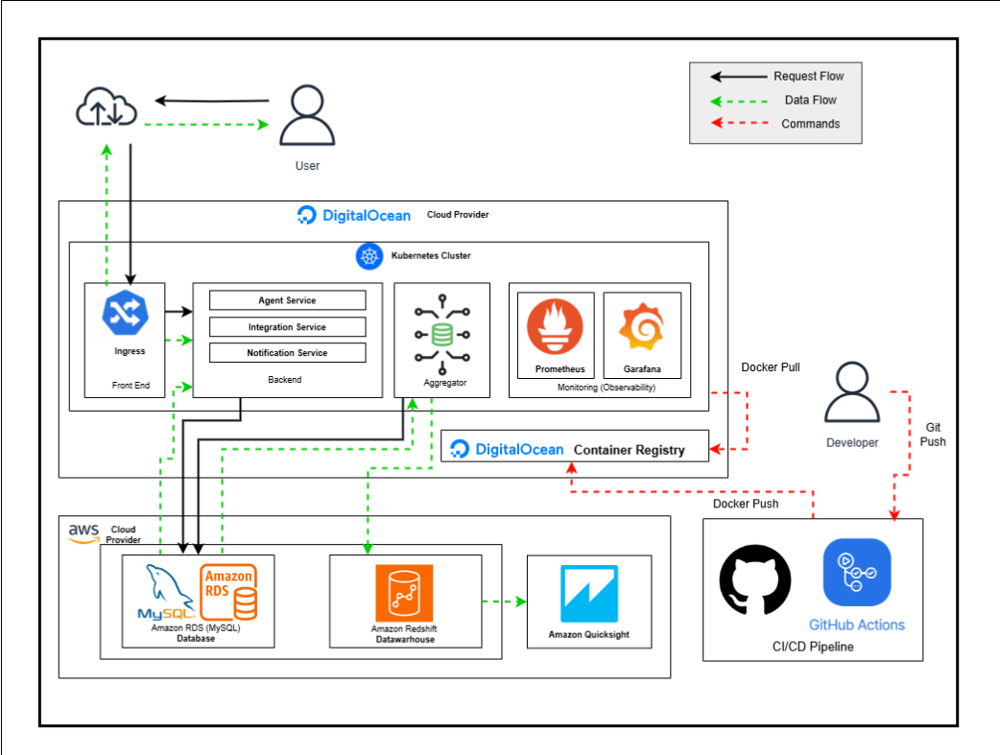
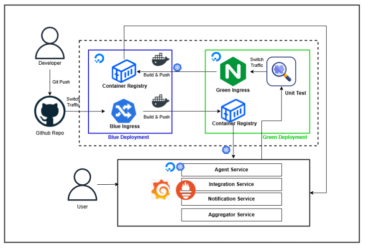

# MoonInsurance - Moon Agent Tracker

## Overview

**MoonInsurance** is a fictional life insurance company looking to build a cloud-native microservices platform named **Moon Agent Tracker**. This solution is designed to manage insurance agent data, track sales, evaluate branch and team performance, and visualize key business metrics. The system is built with Kubernetes and integrates AWS services such as RDS, Redshift, and QuickSight.

## Features

- 🧑‍💼 **Agent Service**: Manages agent profiles and the products each agent is allowed to sell.
- 🔗 **Integration Service**: Receives real-time sales data from MoonInsurance core system and associates them with the correct agents.
- 📢 **Notification Service**: Sends automated notifications when sales targets are achieved.
- 📊 **Aggregator Service**: Scheduled Kubernetes job that generates performance reports (team/product/branch-wise).
- 📈 **Data Warehouse & Visualization**: Metrics are stored in AWS Redshift and visualized using AWS QuickSight dashboards.
- 🔍 **Observability**: Monitors health and performance of each microservice using Prometheus/Grafana or similar tools.
- 🚀 **CI/CD Pipeline**: Fully automated deployment using GitHub Actions with Blue-Green strategy and integration test suite.

## Architecture






**Key Highlights**:
- Microservices communicate internally using HTTP REST APIs.
- All services are containerized using Docker and orchestrated via Kubernetes.
- External access is managed through an API Gateway with rate limiting and security policies.
- CI/CD pipeline triggers on push to `main` branch and supports rollback and integration testing.

## Technologies Used

| Component              | Technology                            |
|------------------------|----------------------------------------|
| Microservices          | Python (Flask)                         |
| Containerization       | Docker                                 |
| Orchestration          | Kubernetes (DigitalOcean K8s)          |
| Database               | AWS RDS (MySQL)                        |
| Data Warehouse         | AWS Redshift                           |
| Visualization          | AWS QuickSight                         |
| CI/CD Pipeline         | GitHub Actions                         |
| Monitoring             | Prometheus, Grafana                    |
| Testing                | Pytest, Integration Tests              |

## Setup and Deployment

1. **Clone Repository**  
   ```bash
   git clone https://github.com/your-username/mooninsurance.git
   cd mooninsurance
   ```

2. **Set Environment Variables**  
   Create a `.env` file and configure credentials for:
   - AWS RDS and Redshift
   - DigitalOcean cluster
   - API Gateway keys

3. **Build Docker Images**
   ```bash
   docker build -t agent-service ./agent_app
   docker build -t integration-service ./integration_app
   docker build -t notification-service ./notification_app
   docker build -t aggregator-service ./aggregator_app
   ```

4. **Deploy to Kubernetes**
   ```bash
   kubectl apply -f k8s/
   ```

5. **Trigger CI/CD Pipeline**
   Push code to `main` to trigger GitHub Actions workflow.

6. **View Metrics**
   Access dashboards in AWS QuickSight using your admin credentials.

## Testing

- Run unit tests locally:
  ```bash
  pytest tests/
  ```

- Run integration tests post-deployment via CI/CD.

## Security & Ethical Considerations

- Implements API Gateway rate limiting.
- All services enforce authentication and data validation.
- Deployment pipeline enforces secure secrets management and logging.

## Acknowledgements

- [AWS](https://aws.amazon.com)
- [DigitalOcean Kubernetes](https://www.digitalocean.com/products/kubernetes)
- [RGU CMM707 Module Team](https://campusmoodle.rgu.ac.uk)

## License

This project is part of an academic submission and is not intended for commercial use.
